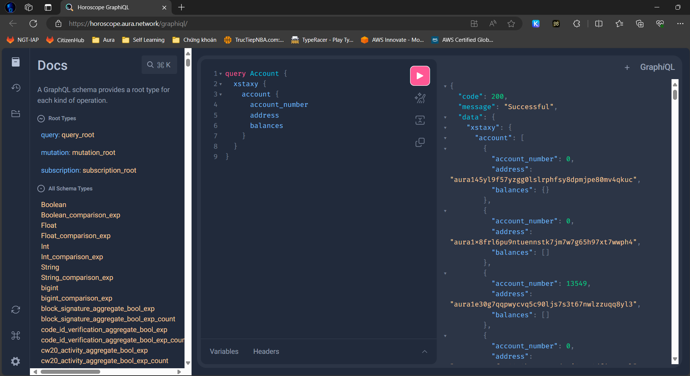

# Hi there, I'm AnDQK! 👋

<!--

-->

## About Me 🚀

I'm a passionate **DevOps Engineer/SRE** with experience in **building scalable infrastructure, automating processes, and ensuring smooth deployment pipelines**. With a strong background in **cloud computing, infrastructure and networking**, I thrive in dynamic environments where collaboration and innovation are valued. I love tackling complex problems, learning new skills, and collaborating with diverse teams to create innovative solutions.

- 🌱 Currently learning: **Azure, Data**
- 🔭 Working on: **Master Tag Register**
- 🌍 Languages: **Vietnamese(native), English, Japanese(basic)**
- 📫 How to reach me: **doquockhanhan@gmail.com**
- ⚡ Fun fact: **I have a passion for billard as much as for my job**

## My Skills 🧠

## Featured Projects 💻

### [Horoscope](https://docs.aura.network/product/horoscope/#horoscope-v2)

**Horoscope** is an **indexing service for Cosmos-based blockchain** built with **MoleculerJS and Hasura**. This project demonstrates my ability to **design, build and implement a system with an application capable of high throughput, near real-time indexer**. You can check out the repository [here](https://github.com/aura-nw/horoscope-v2).

## You can find me on Social at 📬

- **[LinkedIn]**(https://www.linkedin.com/in/andqknoah)
